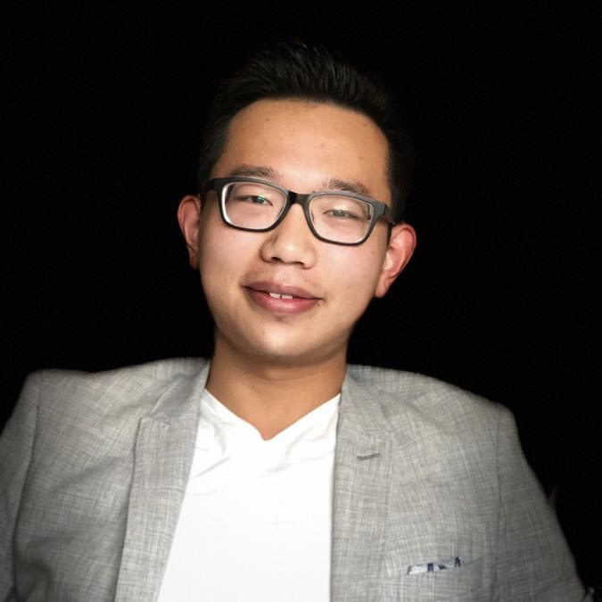

# About Me

{: style="height:300px;width:300px", align=right}

Hi, there! My name is Wenspu (Wen) Yang.

I'm a futurist, foresight consultant, lifelong learner, and aspiring polymath.

I am passionate about researching and making sense of emerging changes, both technological and social; collaborating and understanding different perspectives, and teaching and sharing what I have found.

Professionally, I'm a member of the [Association of Professional Futurists (APF)](https://www.apf.org) and am currently participating in the [Journal of Futures Studies (JFS)](https://jfsdigital.org) Youth Futures Special Issue Program.

Currently living in London, UK, I'm originally from a small mountain town in Yunnan, Southwest China.

Before I discovered my passion for futures and foresight, I worked in Energy Consulting (ESG) and Crypto/Web3 and lived as a digital nomad.

I hold a B.S. in Management Science (Economics) from the University of California, San Diego.

Outside work, I am an avid reader, enjoy cooking, hiking, practice meditation, and follow stoic life philosophy.

If you have any thoughts about this project or would like to connect with me, please contact me on [LinkedIn](https://www.linkedin.com/in/wensupuyang/) or drop me an [email](mailto:<wensupu.yang@gmail.com>). I'd be more than happy to hear from you.
