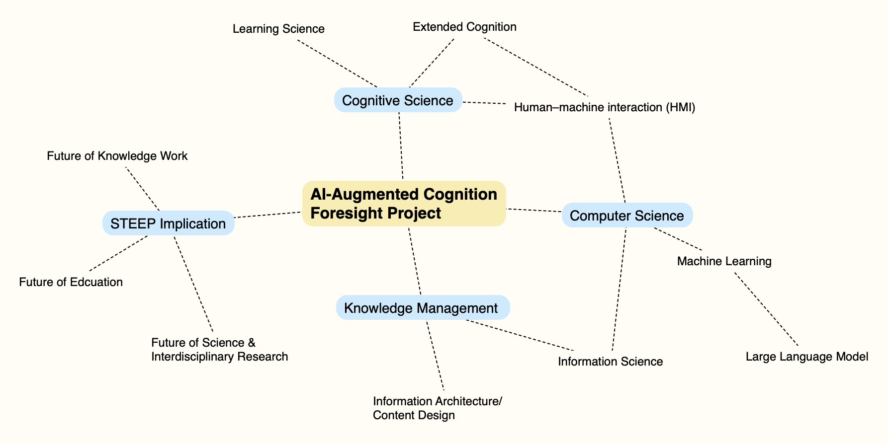
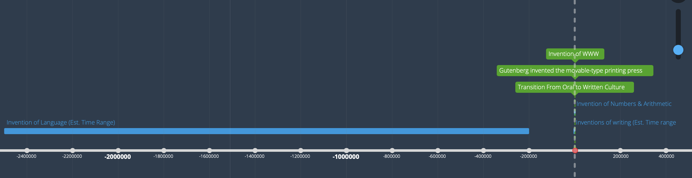
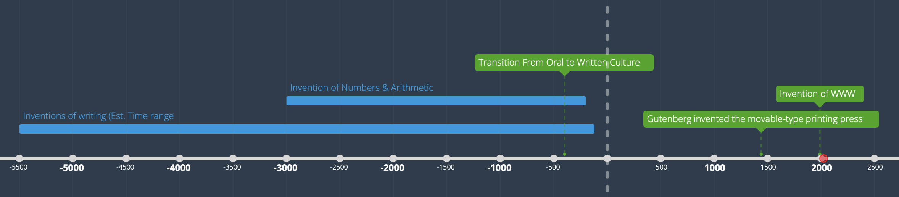
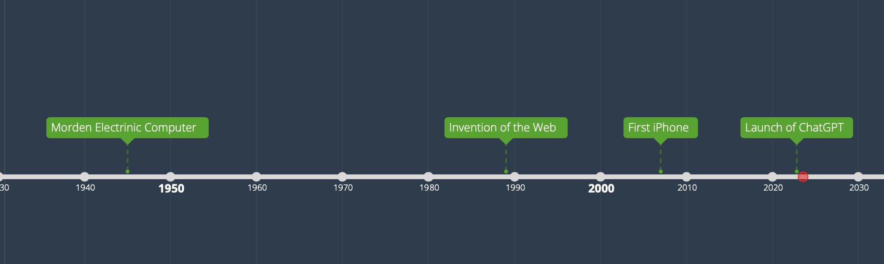

# Home
## Introduction 
We live in a world of increasing change, complexity, uncertainty, and global challenges. As modern knowledge workers, do you ever feel adrift in a sea of information overload, struggling to navigate the ever-expanding universe of knowledge? It often seems that our cognitive ability to process, comprehend, and engage in sense-making is bottlenecked, unable to keep up despite our best efforts.

However, human cognition is not set in stone, nor completely bound by genetics. Many of us would have a hard time trying to "think" without the aid of computers and the internet. But even if you're old-school, try to imagine thinking and learning without books, paper, and pen; what about without numbers and language itself?

We often take these innovations for granted, but they suggest our cognitive ability has always been augmented by human inventions. With the recent leaps in artificial intelligence, particularly large language models (LLMs), it seems plausible that these could represent the next phase in cognitive augmentation.

For this project, I'll use strategic foresight and draw on disciplines like cognitive science, machine learning, knowledge management, and learning theory to explore the future of augmented cognition. Just as in the past, language, writing, and the printing press augmented our cognition, I'd like to explore if AI, more specifically, LLMs, could be the next phase of externalized, distributed human cognition. And if so, how can knowledge workers best work with AI to realize human potential?

This is a multifaceted and extremely complex problem. It would be hubris to assume I can solve it alone. However, I'm really passionate about it and believe it has great leverage and importance.

In the spirit of "[Building in Public](https://publiclab.co/building-in-public/what-is-it)" and "[Learn In Public](https://www.swyx.io/learn-in-public)", I'm making this a "Foresight in Public" project. 

My hope is twofold: 

1. by demonstrating an ongoing foresight project, I aim to promote strategic foresight and future thinking 
2. by sharing my learning and research, I hope to spark your interest and would love to hear from you. (Connect with me on LinkedIn or drop me an email, contact details are at the bottom right of the page.)

## Framing
### Domain Map 

Updated on: 2023-07-25

#### Referece:

- [Andy Hines_Introducing The Future of Knowledge Work: Domain Map | Hinesight....for Foresight](https://www.andyhinesight.com/introducing-the-future-of-knowledge-work-domain-map/)

- [Policy Horizons Canada_Domain Mapping Exercise #1 – Facilitator’s Guide](https://horizons.gc.ca/wp-content/uploads/2018/12/2016-274-guide_domainmap1-eng.pdf)

- Slaughter, R., & Hines, A. (2020). _The Knowledge Base of Futures Studies 2020_ (pp. 200–202). Association of Professional Futurists.

### Historical Perspective: Look Back to Look Forward

Updated on: 2023-07-27
Link to interactive timeline: 
[Augmented Cognition History - Timeline](https://time.graphics/line/91caa512bc850cce5ac2ddff81add543)

Screenshot View

#### Referece: 

- [Ep. 42 - Awakening from the Meaning Crisis - Intelligence, Rationality, and Wisdom - Meaning Crisis Collection](https://www.meaningcrisis.co/ep-42-awakening-from-the-meaning-crisis-intelligence-rationality-and-wisdom/)

- J Adam Carter, Clark, A., Jesper Kallestrup, & Pritchard, D. (2018). _Extended epistemology_. Oxford University Press.

- Clark, A. (2010). _Natural-born cyborgs : minds, technologies, and the future of human intelligence_. Oxford Univ. Press.

---

**Work in Progress**

## Signal Scanning

## Expert Interviewing

## Scenario Planning

## Action